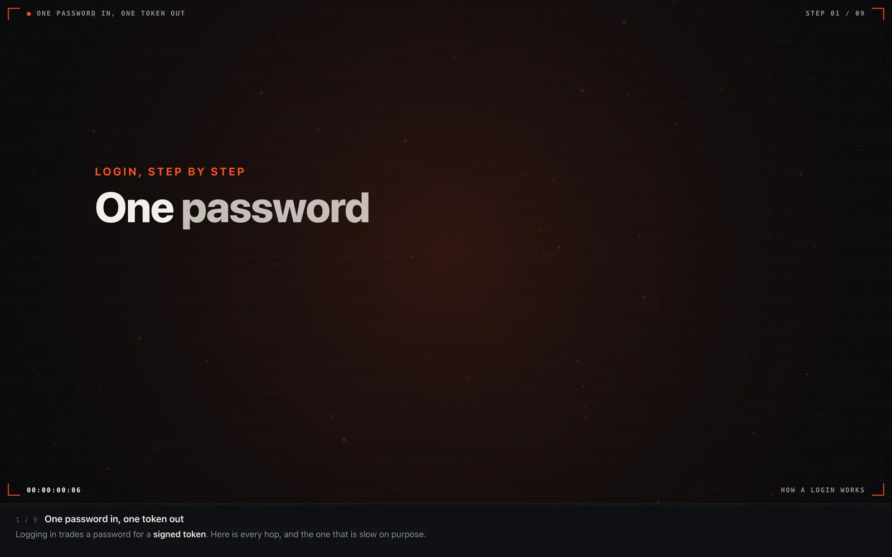
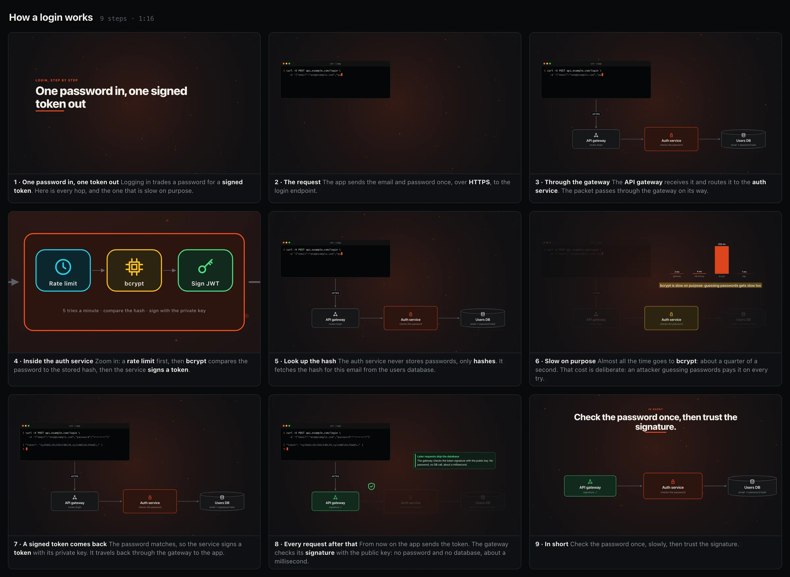

<div align="center">

# motion-explainer

**Ask Claude to explain something. Get a motion-graphics animation you can pause, step through and zoom into.**

A [Claude Code](https://claude.com/claude-code) skill. One prompt in, one self-contained HTML player out.

[**▶ Live demos**](https://4lxn.github.io/motion-explainer/) · [Quick setup](#quick-setup) · [Scene format](REFERENCE.md)

[](https://github.com/4lxn/motion-explainer/actions/workflows/test.yml) [](LICENSE)



</div>

---

## What you get

```text
you  > /motion-explainer how does a GitHub Actions job reach a self-hosted runner?
claude > storyboards 8 steps, writes a scene, builds it, screenshots every step,
         fixes what looks wrong, then opens the player.
```

- **A real player, not a video.** Play/pause, step with `←` `→`, scrub, change speed.
- **Zoom into anything.** Scroll or pinch to zoom, drag to pan, double-click a box to fly into it. Boxes can hold detail that only appears once you zoom in.
- **One HTML file.** Engine, scene and (optional) narration inlined. No network, no CDN, strict CSP. Email it, attach it to a PR, open it offline.
- **Self-checking.** Every build is linted in headless Chrome: overlapping boxes, text that doesn't fit, arrows through boxes, off-canvas elements. Claude also screenshots each step and looks at it before showing you.
- **Optional local voice.** Narrate each step with the offline [Kokoro](https://github.com/thewh1teagle/kokoro-onnx) TTS model. Nothing leaves your machine.

<div align="center">

<br><sub>Every step of one explainer at a glance (<code>motion shot</code>). Step 5 zooms inside a runner.</sub>
</div>

## Quick setup

**Needs:** macOS or Linux, Google Chrome or Chromium, `bash`, `openssl`. Nothing to install from npm or pip.

**Option A: plugin** (Claude Code updates it for you). Inside Claude Code:

```text
/plugin marketplace add 4lxn/motion-explainer
/plugin install motion-explainer@motion-explainer
```

**Option B: git clone** (one command, update with `git pull`):

```sh
git clone https://github.com/4lxn/motion-explainer ~/.claude/skills/motion-explainer
```

Pick one; if both are installed, the plugin copy wins. Then, in Claude Code:

```text
/motion-explainer how TCP's three-way handshake works
```

Or just say *"animate this architecture"* or *"explain it with an animation"*.

Something off? `motion doctor` (plugin installs put `motion` on Claude's PATH) or `~/.claude/skills/motion-explainer/bin/motion doctor` (git clone) checks Chrome, `openssl` and an end-to-end build, and prints the fix for anything missing.

<details>
<summary><b>Chrome in a non-standard place?</b></summary>

```sh
export MOTION_CHROME="/path/to/chrome-or-chromium"
```

On Windows, run it inside WSL with Chromium installed. The built HTML plays in any modern browser on any OS.

Headless Chrome won't start in Ubuntu 24.04 CI or containers? Allow its sandbox: `sudo sysctl -w kernel.apparmor_restrict_unprivileged_userns=0` (this repo's CI does the same).
</details>

## Use the CLI directly

The skill drives `bin/motion`. You can too:

```sh
M=~/.claude/skills/motion-explainer/bin/motion   # on PATH as `motion` when installed as a plugin
$M new   my-topic                # my-topic.scene.js from a starter (or: new my-topic architecture|algorithm|idea|story)
$M build my-topic.scene.js       # inline everything into my-topic.html, then lint it
$M shot  my-topic.html           # one PNG with every step's resting state
$M shot  my-topic.html 4@1.5     # step 4, 1.5 s in: check motion mid-flight
MOTION_SCALE=2 $M shot my-topic.html   # retina-sharp PNGs
$M open  my-topic.html           # chromeless 1440x900 app window
$M voice my-topic.scene.js       # optional: local narration, then build again
$M doctor                        # check the setup
```

Lint errors name the scene line and suggest the closest valid name:

```text
error 'cache': unknown type 'bxo'. Did you mean 'box'?
error step 2: unknown id 'dbb'. Did you mean 'db'?
error js: Uncaught ReferenceError: lable is not defined (my-topic.scene.js:14)
```

A scene is a small JS file: declare the elements, then the steps that reveal and move them.

```js
Motion.scene({
  title: 'Cache hit vs miss',
  elements: [
    { id: 'app',   type: 'box', x: 300,  y: 450, label: 'App' },
    { id: 'cache', type: 'box', x: 800,  y: 450, label: 'Cache', tone: 'accent' },
    { id: 'db',    type: 'box', x: 1300, y: 450, label: 'Database', shape: 'db' },
    { id: 'a1', type: 'arrow', from: 'app', to: 'cache' },
    { id: 'a2', type: 'arrow', from: 'cache', to: 'db' },
  ],
  steps: [
    { title: 'Ask the cache first', say: 'The app checks the cache before the database.',
      do: [{ show: ['app', 'cache', 'a1'] }, { flow: 'a1', label: 'GET' }] },
    { title: 'Miss: go to the database', say: 'On a **miss**, the cache asks the database and keeps the answer.',
      do: [{ show: ['db', 'a2'] }, { flow: 'a2' }, { flow: 'a2', reverse: true, label: 'row' }, { pulse: 'cache', tone: 'ok' }] },
  ],
});
```

Elements: boxes, circles, text, arrows, zones, notes, code panels, icons, charts, terminal and browser mockups, kinetic titles, particles. Actions: `show`, `hide`, `set`, `flow`, `focus`, `camera`, `pulse` and more. Full format: [REFERENCE.md](REFERENCE.md).

## Player keys

| Key | Does |
|---|---|
| `Space` | play / pause |
| `←` `→` | previous / next step |
| scroll, pinch | zoom |
| drag | pan |
| double-click a box | zoom into it |
| `S` | step mode: pause after each step |
| `[` `]` | slower / faster |
| `T` | light / dark |
| `V` | mute narration |
| `?` | all keys |

`#4` at the end of the URL opens step 4.

## Examples

| Scene | Shows | Live |
|---|---|---|
| [`gha-self-hosted-runner`](examples/gha-self-hosted-runner.scene.js) | architecture, flows, semantic zoom | [open](https://4lxn.github.io/motion-explainer/gha-self-hosted-runner.html) |
| [`binary-search`](examples/binary-search.scene.js) | algorithm; steps generated from a real run | [open](https://4lxn.github.io/motion-explainer/binary-search.html) |
| [`retry-jitter`](examples/retry-jitter.scene.js) | an idea over time, live charts | [open](https://4lxn.github.io/motion-explainer/retry-jitter.html) |
| [`showcase`](examples/showcase.scene.js) | icons, mockups, kinetic type, `hud` theme | [open](https://4lxn.github.io/motion-explainer/showcase.html) |

## How it works

```text
scene.js ──► bin/motion build ──► one .html (engine + scene inlined, hash-pinned CSP)
                                    │
                                    ├─► headless Chrome lint  (overlaps, fit, ids)
                                    └─► motion shot           (PNG per step, Claude reviews it)
```

`engine/player.js` compiles the scene into tweens and paints SVG; `engine/player.css` styles the player; `bin/motion` is plain bash 3.2.

## Updating

Plugin: `claude plugin update motion-explainer@motion-explainer`. Git clone: `git -C ~/.claude/skills/motion-explainer pull`. What changed: [CHANGELOG.md](CHANGELOG.md).

## Development

```sh
test/run.sh   # lints every example, runs player-control, resource, voice, CLI and lint tests
```

CI runs it on Ubuntu and macOS. See [CONTRIBUTING.md](CONTRIBUTING.md).

## License

[MIT](LICENSE). The optional voice feature downloads Kokoro weights (Apache-2.0) and uses `phonemizer` / espeak-ng (GPL-3.0); they are not bundled here.
